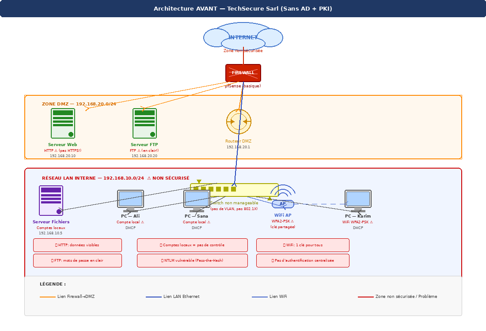
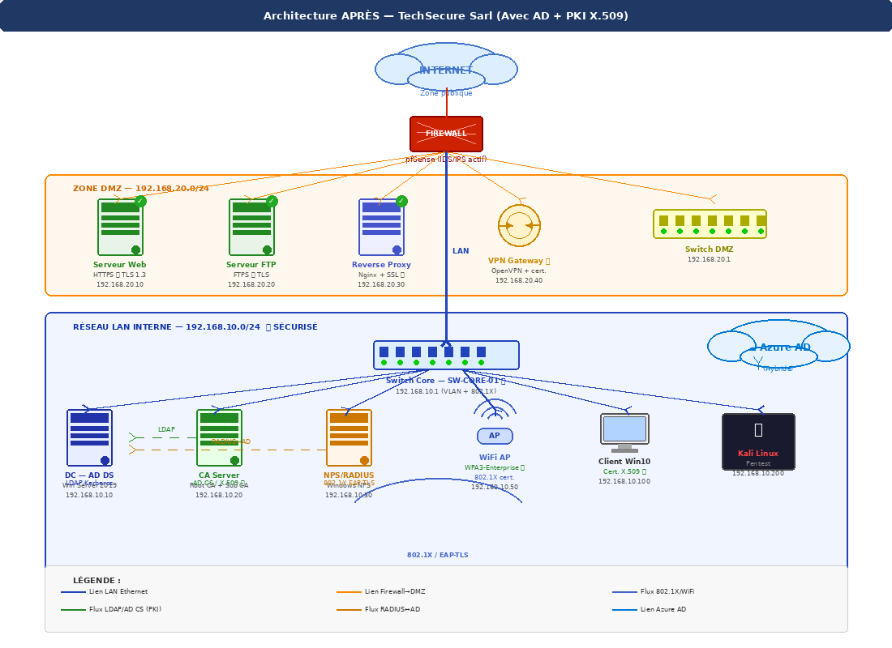

# TechSecure Sarl — Infrastructure de Sécurité d'Entreprise (AD + PKI)

Projet réalisé dans le cadre du cours Sécurité Réseaux & PKI à l'ISI Kef :
migration d'un environnement vulnérable (comptes locaux, NTLM, Wi-Fi partagé)
vers une infrastructure sécurisée sur 6 VM.

## Architecture

### Avant (existant non sécurisé)

### Après (avec AD + PKI X.509)

## Composants déployés
- VM1 — Active Directory Domain Services (domaine techsecure.local, GPO, DNS)
- VM2 — PKI privée (Root CA + CA subordonnée, certificats X.509)
- VM3 — NPS/RADIUS (802.1X EAP-TLS)
- VM4 — Apache HTTPS/TLS 1.3
- VM5 — Client Windows 10 joint au domaine
- VM6 — Kali Linux (validation sécurité)

## Résultat
Attaque Pass-the-Hash (Responder) : 0 hash NTLM capturé, confirmant le
basculement effectif vers l'authentification Kerberos.

## Captures d'écran

Classées par composant dans `screenshots/` :

- `screenshots/ad/` — VM1 (Active Directory) et jonction/connexion de VM5 au domaine
- `screenshots/pki/` — VM2 (Root CA, AD CS, templates de certificats, GPO auto-enrollment) et le magasin de certificats de confiance sur VM5
- `screenshots/radius/` — VM3 (NPS, client RADIUS, politique EAP-TLS)
- `screenshots/apache/` — VM4 (Apache HTTPS, CSR, certificat, avertissement Firefox)
- `screenshots/kali/` — VM6 (nmap, Responder, openssl, ldapsearch)

Voir `image-mapping.md` pour la correspondance détaillée entre chaque capture et la section du rapport qu'elle illustre.

## Démonstration vidéo
🎥 [Voir la démo sur Drive](https://drive.google.com/file/d/18p0vel6CIwDqqo9bVFbOihk6C88uxtZQ/view?usp=drive_link)
